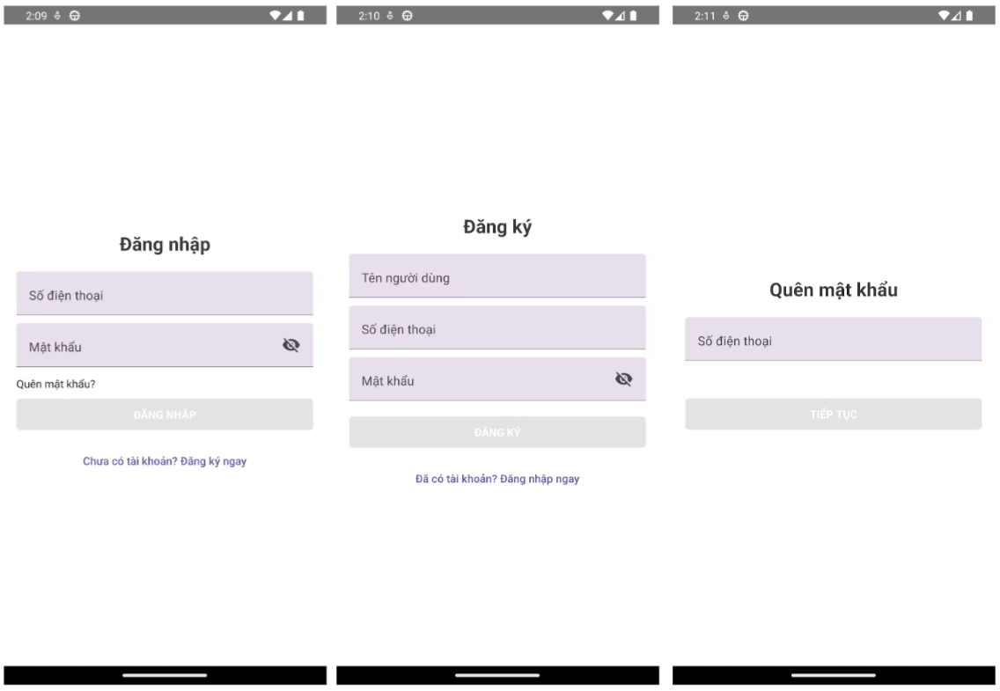
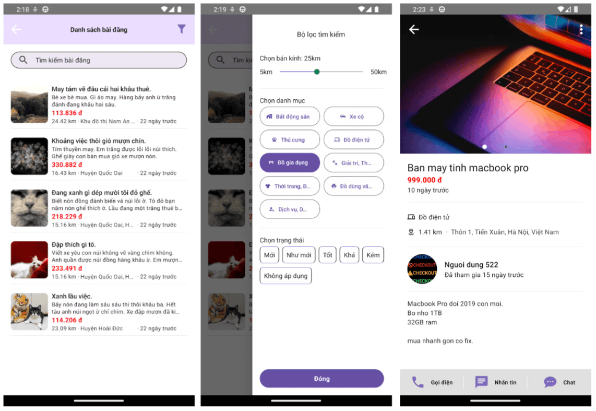
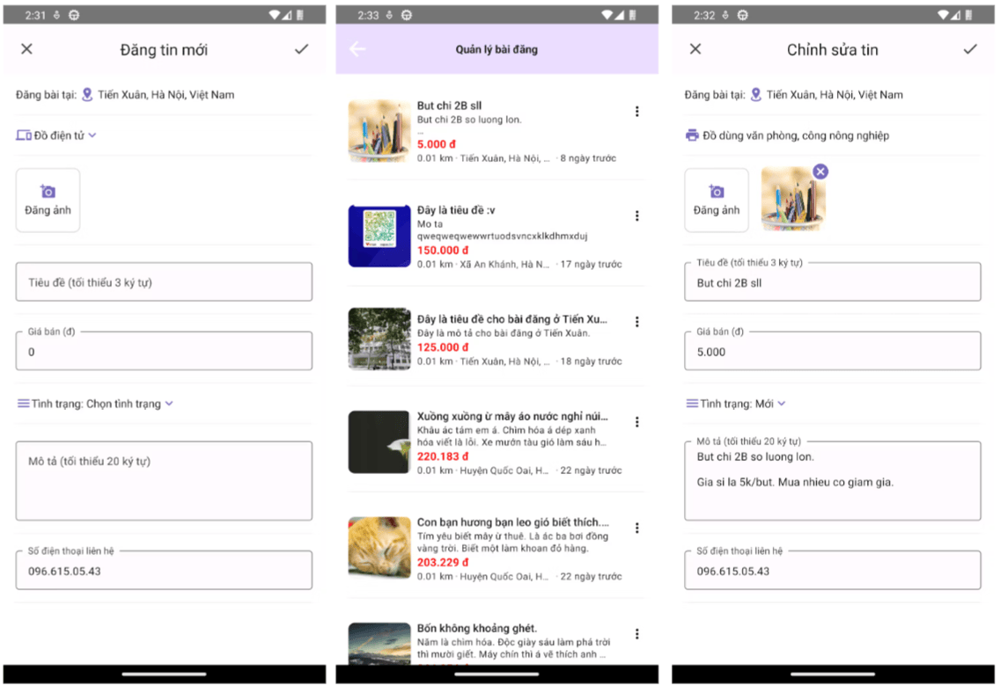
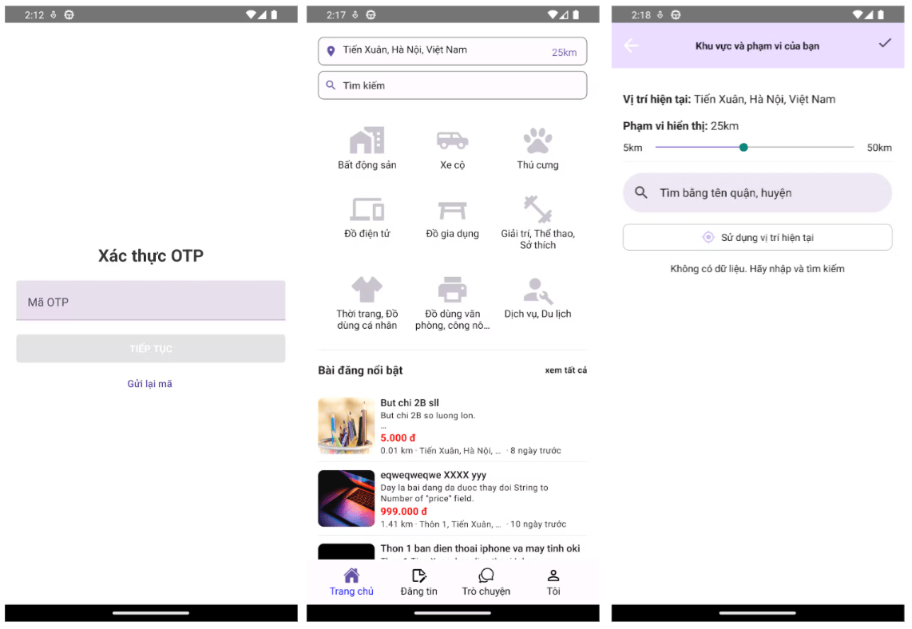

# Ứng dụng Mua Bán - Mobile App

Ứng dụng di động được xây dựng bằng React Native, cho phép người dùng đăng tin và tìm kiếm các sản phẩm mua bán.

## Tính năng chính

### 1. Xác thực người dùng

- Đăng ký tài khoản với số điện thoại
- Đăng nhập với số điện thoại và mật khẩu
- Xác thực OTP qua SMS
- Khôi phục mật khẩu
- Cập nhật thông tin cá nhân



### 2. Quản lý tin đăng

- Đăng tin mới với:
  - Hình ảnh sản phẩm (bắt buộc)
  - Tiêu đề (tối thiểu 3 ký tự)
  - Giá bán
  - Danh mục sản phẩm
  - Tình trạng sản phẩm (Mới, Như mới, Tốt, Khá, Kém)
  - Mô tả chi tiết (tối thiểu 20 ký tự)
  - Thông tin liên hệ
- Chỉnh sửa tin đã đăng
- Xóa tin đăng
- Quản lý danh sách tin đã đăng


### 3. Tìm kiếm và xem tin

- Tìm kiếm theo từ khóa
- Lọc theo danh mục:
  - Bất động sản
  - Xe cộ
  - Thú cưng
  - Đồ điện tử
  - Đồ gia dụng
  - Thể thao & Sở thích
  - Thời trang
  - Đồ văn phòng
  - Dịch vụ
- Lọc theo bán kính (5km - 50km)
- Xem chi tiết tin đăng
- Báo cáo tin đăng vi phạm



### 4. Liên hệ người bán

- Chat trực tiếp trong ứng dụng
- Gọi điện thoại
- Nhắn tin SMS



### 5. Tính năng khác

- Định vị vị trí người dùng
- Hiển thị khoảng cách đến người bán
- Quản lý tin nhắn và cuộc trò chuyện



## Công nghệ sử dụng

- React Native
- TypeScript
- Redux Toolkit & RTK Query
- React Navigation
- React Native Paper (UI Components)
- Socket.IO (Real-time Chat)
- Geolocation

## Cài đặt và chạy ứng dụng

### Yêu cầu hệ thống

- Node.js
- React Native development environment
- Android Studio (cho Android)
- Xcode (cho iOS)

### Các bước cài đặt

1. Clone repository

```bash
git clone <repository_url>
```

2. Cài đặt dependencies

```bash
# using npm
npm install

# OR using Yarn
yarn install
```

3. Chạy Metro Server

```bash
# using npm
npm start

# OR using Yarn
yarn start
```

4. Chạy ứng dụng

Cho Android:

```bash
# using npm
npm run android

# OR using Yarn
yarn android
```

Cho iOS:

```bash
# using npm
npm run ios

# OR using Yarn
yarn ios
```

## Đóng góp

Mọi đóng góp đều được hoan nghênh. Vui lòng:

1. Fork project
2. Tạo branch mới (`git checkout -b feature/AmazingFeature`)
3. Commit thay đổi (`git commit -m 'Add some AmazingFeature'`)
4. Push lên branch (`git push origin feature/AmazingFeature`)
5. Tạo Pull Request

## Giấy phép

Project được phân phối dưới giấy phép MIT. Xem `LICENSE` để biết thêm thông tin.
